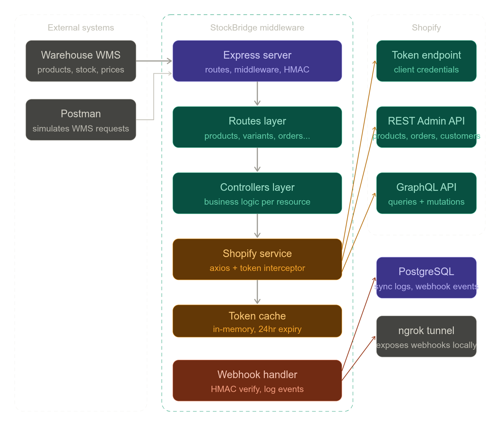

**🏭 StockBridge**

*"The backend nerve center for multi-warehouse Shopify sellers"*

**The Problem:**
Mid-size Shopify merchants who sell across multiple warehouses struggle to keep product data, inventory levels, and order status in sync. Their warehouse management system (WMS) doesn't talk to Shopify automatically — staff manually update SKUs, prices, and stock counts which causes overselling, wrong prices, and delayed orders.

**What StockBridge does:**
It sits between the warehouse system and Shopify as a middleware sync engine. The warehouse system calls StockBridge's REST endpoints whenever something changes — a new product arrives, stock is updated, a price changes — and StockBridge pushes that change to Shopify instantly. It also listens to Shopify webhooks and reflects order/customer changes back to the warehouse.

**Real world users:** A clothing brand with 3 warehouses, a electronics reseller managing 500+ SKUs, a B2B supplier syncing bulk inventory daily.

**Core flows:**

```
Warehouse system          StockBridge             Shopify
──────────────────────────────────────────────────────────
New product arrives   →   POST /api/products   →  Create product + variants
Price updated         →   PUT  /api/variants   →  Update price + SKU  
Stock received        →   PUT  /api/inventory  →  Adjust inventory qty
New order in Shopify  →   Webhook /orders      →  Log to warehouse DB
Customer registered   →   Webhook /customers   →  Tag + segment customer
App removed           →   Webhook /app         →  Cleanup all store data
```

**Tech stack:**
- Node.js + Express
- Axios for Shopify API calls
- PostgreSQL to log sync history & webhook events
- ngrok for local webhook testing
- Postman collection as the "warehouse simulator"

