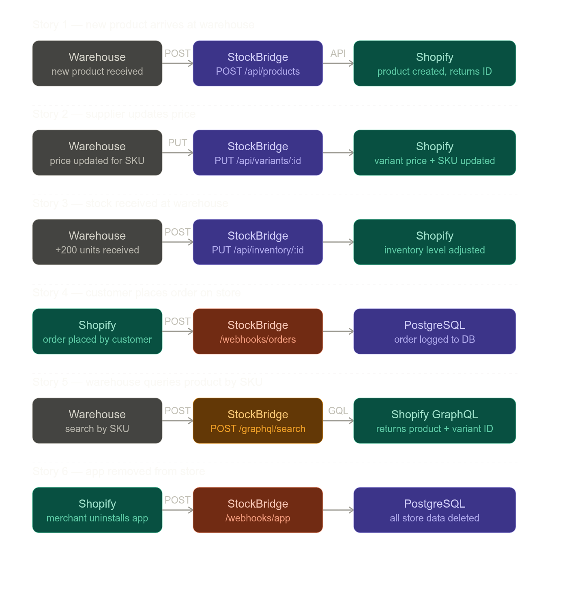
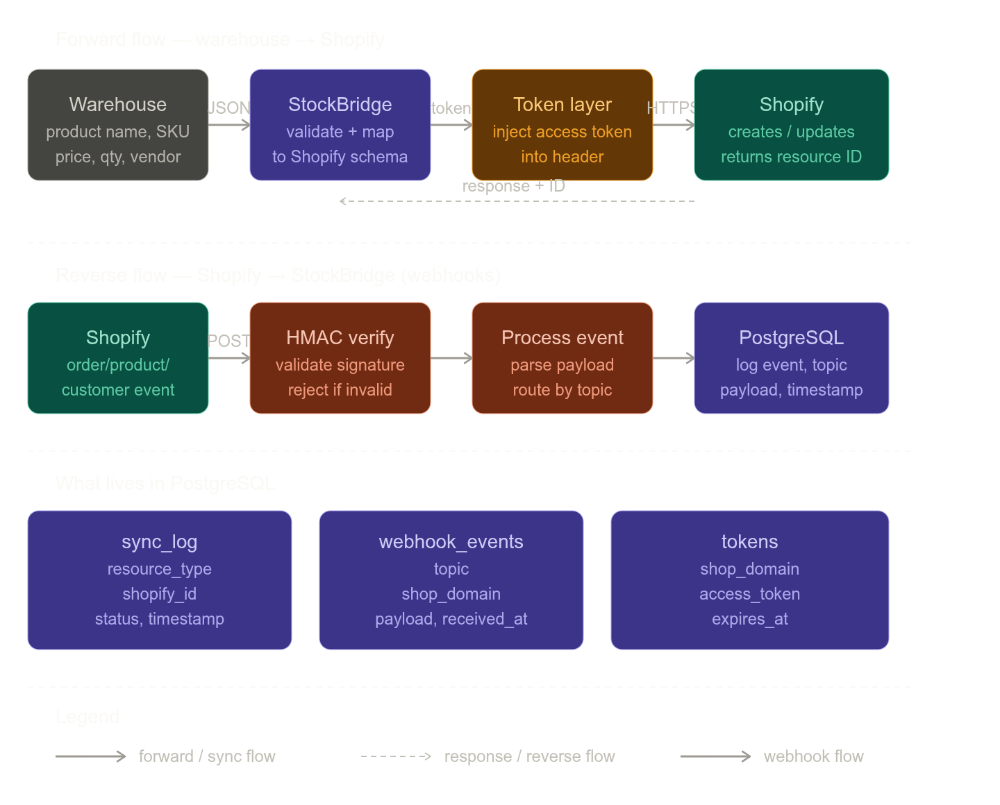

**StockBridge — Product Requirement Spec**

{width=400}

**Purpose:** StockBridge is a middleware sync engine. It sits between a warehouse management system (WMS) and a Shopify store. Its job is to keep product data, inventory levels, and customer records in sync — and to react to Shopify events in real time via webhooks.

---

**Core requirements:**

*Products & variants* — when the warehouse receives new stock, StockBridge creates the product in Shopify with title, vendor, and tags. It then creates variants with correct SKUs. When the supplier changes a price, StockBridge updates the variant price and SKU. When stock is counted, it adjusts inventory quantity at the correct location.

*Customers* — when a new B2B customer is onboarded in the warehouse system, StockBridge creates the customer in Shopify, applies segment tags (e.g. `wholesale`, `vip`), and supports search by email to avoid duplicates.

*Orders* — StockBridge fetches order details from Shopify for the warehouse to process. It never creates orders — orders always originate from the storefront.

*GraphQL layer* — all search operations use GraphQL. The warehouse can query a product by SKU to get its Shopify ID and variant ID. Customer order history and inventory levels are also fetched via GraphQL for efficiency.

*Webhooks* — Shopify fires events to StockBridge whenever an order is placed or updated, a product is created or updated, a customer registers, or the app is uninstalled. StockBridge verifies every webhook with HMAC signature before processing. All events are logged to PostgreSQL with topic, payload, and timestamp.

---

**What success looks like:** a warehouse operator sends a POST to `/api/products` with raw product data, and within seconds the product appears in the Shopify admin — correctly titled, tagged, and with the right inventory count. When a customer places an order on the storefront, StockBridge receives the webhook and the warehouse DB is updated without any manual step.

Ready to start writing Phase 1 — Products API code?